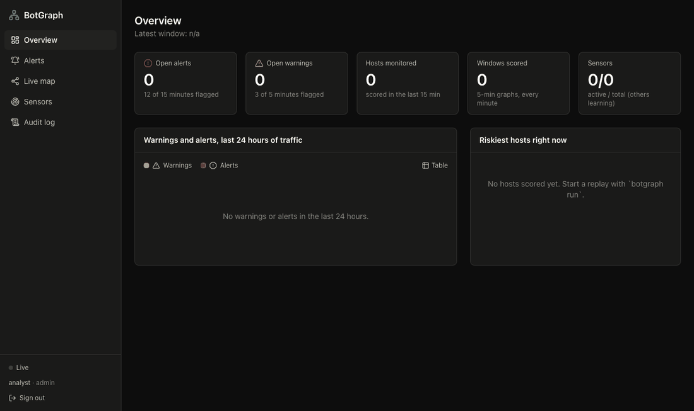
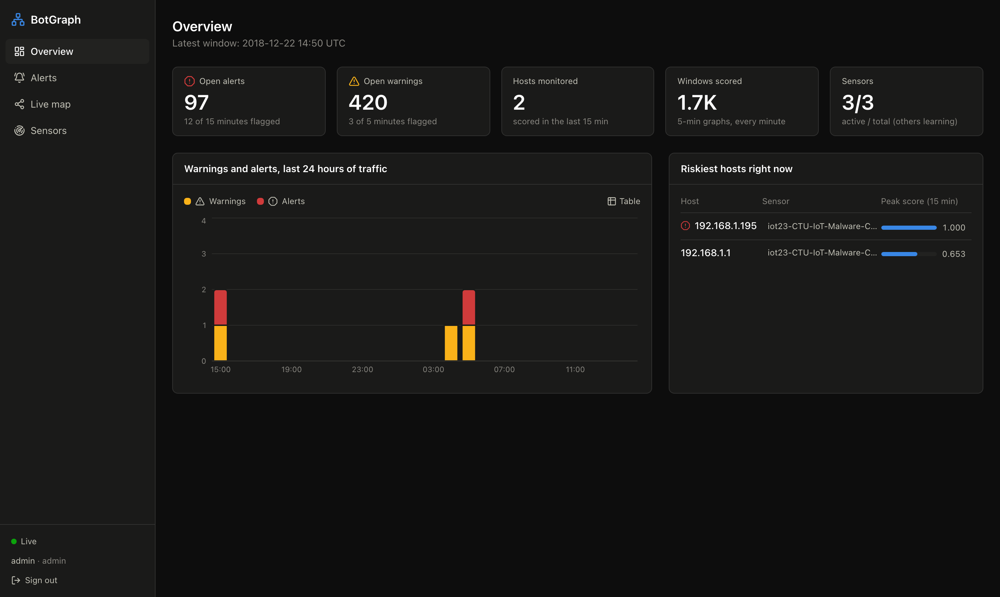
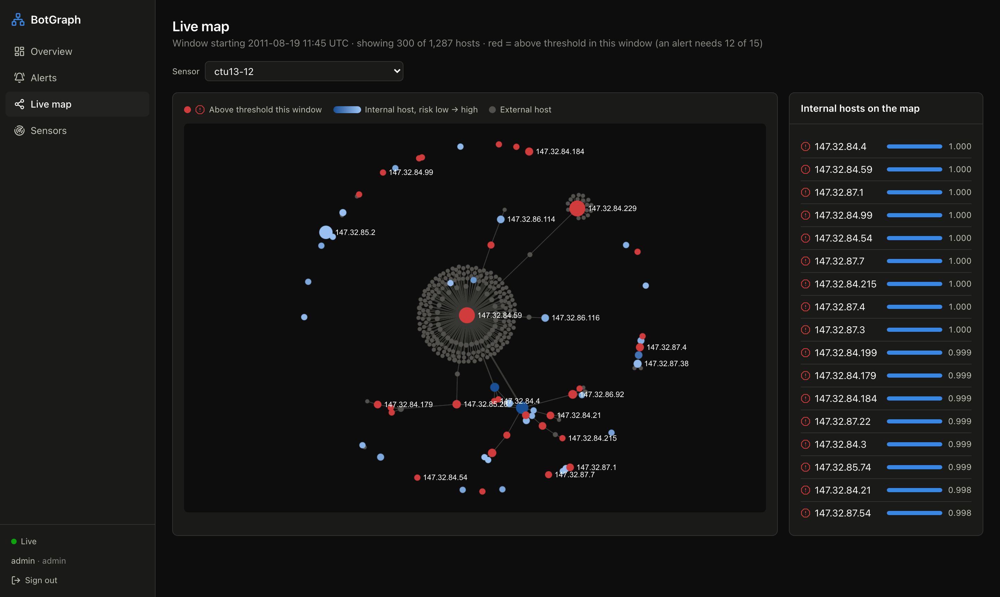
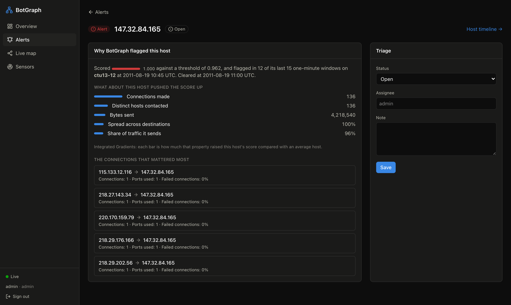
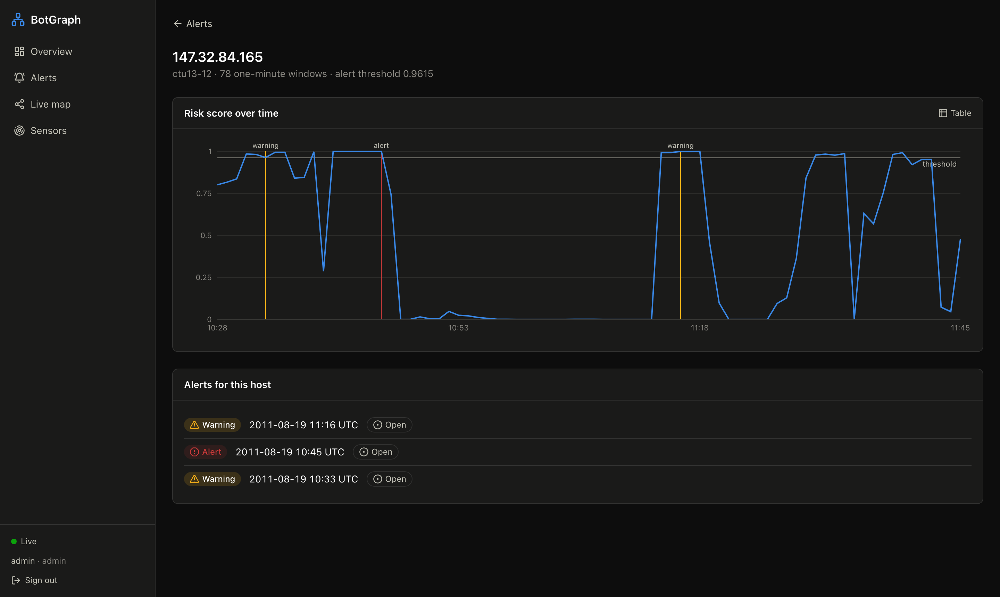

# BotGraph

**Botnet detection with graph neural networks.** BotGraph turns network flows into a
host-to-host communication graph every minute and uses a GNN trained in-house to flag infected
hosts. It targets the coordinated behaviour that per-flow detectors miss: C2 beaconing,
fan-out scanning and peer-to-peer bot meshes.

> Status: **Phases 0–6 done.** Three GNNs trained and evaluated on all 13 CTU-13 scenarios
> (leave-one-family-out CV) and on IoT-23 without retraining, a live detection pipeline
> (`botgraph run`), an analyst console, and production operations: metrics and alerting,
> drift monitoring, security hardening and a Helm chart. See the [model card](docs/model_card.md).



*A replay of CTU-13 scenario 12 at 120× speed: alerts appear as the bots act, each with an
explanation of which flows and features drove it.*

## Results

Evaluated with **leave-one-family-out cross-validation** on CTU-13: each of the 7 botnet
families is the test set once and is never seen in training; decision thresholds and the alert
rule are chosen on a *different* validation family.

| Model | Mean PR-AUC (7 unseen families) | Bots alerted | Normal hosts falsely alerted |
|---|---|---|---|
| XGBoost (host features only) | 0.750 ± 0.19 | 30/35 | 11/78 |
| E-GraphSAGE | 0.844 ± 0.25 | 29/35 | 10/78 |
| **GATv2** | **0.870 ± 0.25** | **30/35** | **5/78** |

Alerts use the tuned rule "flagged in 12 of the last 15 minutes". With the same rule, **GATv2
catches as many bots as XGBoost with half the false alerts**, and it scores each 5-minute
window in ~10 ms on a laptop CPU.

Two alert levels are planned for the live system, both measured on the same folds:

| Level | Rule | GATv2 bots | GATv2 false alerts | Median time to alert |
|---|---|---|---|---|
| Warning | 3 of last 5 min | 34/35 | 22/78 | 2 min |
| Alert | 12 of last 15 min | 30/35 | 5/78 | 28 min |

### Cross-dataset test: IoT-23, no retraining

The CTU-13 models were applied unchanged (same weights and thresholds) to 14 IoT-23 captures:
a different network, IoT devices instead of PCs, and different malware (Mirai, Gafgyt, Hide and
Seek, Muhstik, Hakai, Torii, a Trojan) plus 3 benign IoT honeypots. Labels come from IoT-23's
per-flow labels ([`ml/reports/iot23/report.md`](ml/reports/iot23/report.md)).

| Model | Window PR-AUC | Infected devices alerted (12 of 15) | Benign devices alerted (12 of 15) |
|---|---|---|---|
| XGBoost | 0.470 | 9/13 | 6/24 |
| GraphSAGE | **0.974** | 11/13 | 6/24 |
| E-GraphSAGE | 0.931 | 12/13 | 6/24 |
| GATv2 | 0.962 | 11/13 | **5/24** |

What transfers and what does not:

- **Scanning botnets transfer almost perfectly.** On the Hide and Seek, Muhstik, Hakai and
  Mirai captures every GNN scores PR-AUC 0.99–1.00, while XGBoost on host features alone drops
  to 0.45–0.98. Fan-out scanning looks the same on any network, and the graph captures it.
  Gafgyt is harder (0.49–0.74), but its infected device is still alerted.
- **Normal IoT devices look like bots to a model trained on PCs.** The false alerts are a
  Philips Hue, an Amazon Echo and home routers, flagged in 50–92% of their windows. IoT devices
  heartbeat to cloud servers on a fixed schedule; on CTU-13's university PCs, that periodic
  pattern almost always meant C2 beaconing.
- **Stealthy, low-volume bots are not detected for the right reason.** Torii and the Trojan
  (14–18 malicious flows a day) were flagged mostly in windows *without* malicious traffic,
  i.e. for looking like IoT devices, not for their C2 traffic.

### Calibrating to a new network

Two ways to adapt to IoT with a short benign baseline were tested, rotating over the 3 benign
honeypots (calibrate on 2, test on the held-out one and all malware captures):

| Method | Held-out benign windows flagged | Benign devices alerted on malware networks | Infected devices alerted | CTU-13 PR-AUC |
|---|---|---|---|---|
| None | 31–91% | 2/10 | 11/13 | 0.878 |
| **Threshold at 95th pct of baseline** | **0–26%** | **0/10** | 6–10/13 | 0.878 (model unchanged) |
| Fine-tune on benign IoT¹ | worse in 2 of 3 folds (50→77%, 31→48%) | 1/8 → 1/8 | 8/9 → 9/9 | 0.82–0.86 (forgot) |

¹ Run on the first 11 captures, before the 3 large ones finished downloading.

**Threshold recalibration works; fine-tuning does not** (the re-selected threshold collapsed
and the model partly forgot CTU-13). After recalibration every scanning botnet (Hide and Seek,
Muhstik, both large Mirai captures, Gafgyt) is still alerted in every fold; the devices that
drop out are mostly the stealthy ones that were flagged for the wrong reason. Reports:
[`calibration_threshold.md`](ml/reports/iot23/calibration_threshold.md),
[`calibration_finetune.md`](ml/reports/iot23/calibration_finetune.md).

**Takeaway:** BotGraph detects noisy botnet behaviour on networks it has never seen, but it
needs a short learning period on a new network's normal traffic before its alerts are trusted,
and it does not reliably detect low-volume, stealthy C2.

**Limitations.** CTU-13 has only 6 labelled normal hosts (the same ones in every scenario), so
the false-alert numbers come from a small population. The peer-to-peer family NSIS.ay is hard
for every model (PR-AUC 0.30–0.42); short-lived bots (Sogou, a 26-minute capture) can finish
before the strict alert rule fires. Full details: [`ml/reports/comparison.md`](ml/reports/comparison.md),
[`ml/reports/alert_tuning.md`](ml/reports/alert_tuning.md).

## How it works

```
flows (Zeek / NetFlow / CTU-13 / IoT-23)
   └─▶ normalize to one FlowRecord schema
         └─▶ 5-min sliding windows (1-min hop)
               └─▶ directed host graph + node/edge features
                     └─▶ GNN node classification ─▶ host risk score ─▶ alert + explanation
```

Node features include fan-out degree, distinct destination ports, failed-connection ratio,
bytes sent/received, DNS/SMTP/IRC activity, **beacon periodicity** (regularity of
inter-arrival times) and destination entropy. Edges carry aggregated flow statistics.

Training and live inference use the same feature code (`packages/botgraph-core`), so the
features the model sees in production match what it was trained on.

## Repository layout

| Path | Purpose |
|---|---|
| `packages/botgraph-core` | Flow schema, dataset adapters, windowing, graph features |
| `ml/` | Data prep, labels, models, training and evaluation |
| `services/` | Live pipeline: ingest, streaming windows, detector, alerts, replay (`botgraph` CLI) |
| `api/` | FastAPI backend for the console (REST + WebSocket), auth, audit log |
| `web/` | Next.js analyst console |
| `deploy/` | Images, compose (infra, pipeline, Prometheus + Grafana), Helm chart (`deploy/helm/botgraph`) |

## Quick start

```bash
# Python 3.11+ and uv (https://docs.astral.sh/uv/)
uv sync
uv run pytest

# Local infrastructure
cp .env.example .env
docker compose -f deploy/compose/docker-compose.yml up -d
# Redpanda console: http://localhost:8081   MLflow: http://localhost:5000
```

```python
from botgraph_core import WindowSpec, build_window_graph, read_ctu13_binetflow, sliding_windows

flows = read_ctu13_binetflow("capture20110810.binetflow")
for window in sliding_windows(flows, WindowSpec(size_s=300, hop_s=60)):
    graph = build_window_graph(window.flows, window.window_id)
    print(window.window_id, graph.num_nodes, graph.num_edges)
```

## Live detection pipeline

```
flows.raw ──▶ ingest ──▶ flows.normalized ──▶ detector ──▶ detections / alerts ──▶ SQLite / Postgres
 (replay,     validate,                        5-min windows every minute,
  Zeek...)    bad rows → flows.dlq             graph → GATv2 → k-of-n alerts,
                                               learning mode, explanations
```

**Run the demo on your laptop** (no broker or Docker needed; in-process bus + SQLite):

```bash
uv run botgraph run --replay ctu13:6 --fresh     # Menti: a botnet family the model never saw
uv run botgraph run --replay iot23:CTU-IoT-Malware-Capture-34-1 --speed 600   # Mirai, 60-min learning
uv run botgraph alerts                           # alerts with their explanations
```

The replay streams a recorded capture with **labels stripped**; the pipeline never sees ground
truth. A live terminal view shows windows scored, warnings, alerts and recent events, and the
run ends with a summary scored against the hidden labels.

Demo on CTU-13 scenario 6 (Menti, a family the model never trained on), on a MacBook Air:

| Infected host | Normal hosts | Time to alert | Throughput | Window latency |
|---|---|---|---|---|
| alerted (1/1) | 0/6 alerted | 14 min | 22k flows/s, **306× real time** | p50 35 ms, p95 39 ms |

This matches the offline evaluation for Menti exactly. 51 other university hosts that CTU-13
leaves unlabelled were also alerted; with no ground truth for them, they cannot be scored.

- **Streaming windows** use event time with a watermark and allowed lateness; on in-order input
  they are identical to the batch windows used in training (randomised property tests).
- **Alerts** at two levels: *warning* (flagged in 3 of the last 5 windows) and *alert* (12 of
  15). Alert times match the offline evaluation exactly (tested).
- **Learning mode**: a new network is observed first (default 60 min); the threshold becomes
  the 95th percentile of its baseline scores, the calibration validated on IoT-23. Thresholds
  are stored, so a restart does not relearn; `botgraph recalibrate` starts over.
- **Explanations** (Integrated Gradients on the logit) are computed on the host's 2-hop neighbourhood, which gives
  exactly the model's score for a 2-layer GNN at a fraction of the cost.
- Quiet networks are handled: windows need only 1 flow (a lone beacon still gets scored).

**As separate services over Kafka/Redpanda + Postgres** (the same code; verified in CI against a
real broker):

```bash
docker compose -f deploy/compose/docker-compose.yml --profile pipeline up -d
docker compose -f deploy/compose/docker-compose.yml --profile pipeline run --rm replay \
    replay --replay ctu13:6 --speed 60
# or without Docker for the services themselves:
uv run botgraph ingest --metrics-port 9101
uv run botgraph detect --internal-nets 147.32.0.0/16 --learning-minutes 0 --metrics-port 9102
uv run botgraph replay --replay ctu13:6 --speed 60
```

Flows are keyed by sensor, so each network segment stays on one Kafka partition and detectors
scale out by partition. Prometheus metrics (`--metrics-port`): flows ingested/rejected, windows
scored, per-window latency, alert events.

## Analyst console

A FastAPI backend (`api/`) and a Next.js console (`web/`) on top of the live pipeline's store.

| | |
|---|---|
|  |  |
| **Overview**: open alerts and warnings, 24 h trend, riskiest hosts | **Live map**: the latest 5-minute graph, redrawn every minute (Sigma.js/WebGL) |
|  |  |
| **Alert**: why it fired, in plain words, plus triage | **Host**: score over time against the threshold, with alerts |

```bash
uv run botgraph run --replay ctu13:12 --speed 60             # 1. feed the store
uv run botgraph-api create-user --username you --role admin  # 2. an account
uv run botgraph-api serve                                     #    API on :8000
cd web && npm install && npm run dev                          # 3. console on :3000
```

- **Roles:** viewer (read), analyst (triage), admin (recalibrate sensors). JWT auth; the
  WebSocket authenticates with its first message, so tokens never appear in URLs or logs.
- **Live:** new alerts and windows are pushed over a WebSocket; a toast announces new alerts.
- **Explanations** use Integrated Gradients on the model's logit: flagged hosts score ~1.000,
  where probability-based explainers (GNNExplainer) return nothing. The alert above reads as
  136 connections to 136 different hosts, 96% outgoing: the peer-to-peer bot NSIS.ay.
- **Charts** follow a validated palette: status colours always carry an icon and label, risk
  uses a single-hue ramp, and every chart has a table view.
- **Tests:** API tests (auth, roles, triage, WebSocket push and races) and Playwright
  end-to-end tests against a seeded store and a production build (`cd web && npm run e2e`).

## Operations

### Metrics, health and logs

Every long-running service (`ingest`, `detect`, `botgraph-api serve`) takes `--metrics-port`
(or `BOTGRAPH_METRICS_PORT`) and serves `/metrics`, `/healthz` (the service loop is alive) and
`/readyz` (model loaded, broker and store reached) there, never on the public API port.

| Metric | What it tells you |
|---|---|
| `botgraph_windows_scored_total`, `botgraph_last_window_processed_timestamp_seconds` | a sensor went quiet or the detector stalled |
| `botgraph_window_latency_seconds`, `botgraph_explain_latency_seconds`, `botgraph_store_write_seconds` | where scoring time goes |
| `botgraph_consumer_lag_messages`, `botgraph_late_flows_total` | falling behind real time, sensor clock problems |
| `botgraph_host_score`, `botgraph_flagged_hosts`, `botgraph_sensor_threshold` | score distribution and calibration per sensor |
| `botgraph_feature_psi`, `botgraph_score_psi` | drift (below) |
| `botgraph_api_requests_total` (by route template), `botgraph_api_logins_total`, `botgraph_api_login_lockouts_total` | API errors, latency, password guessing |

Logs are one JSON object per line (`BOTGRAPH_LOG_FORMAT=json`, the default off a terminal);
API requests carry an `X-Request-ID`. Alert rules ([`prometheus-alerts.yml`](deploy/helm/botgraph/files/prometheus-alerts.yml),
11 rules, checked with `promtool` in CI) cover stalled detectors, lag, latency, ingest rejects,
late flows, alert storms, drift, API errors and failed-login bursts. A Grafana dashboard is
provisioned automatically:

```bash
docker compose -f deploy/compose/docker-compose.yml --profile pipeline --profile observability up -d
# Grafana http://localhost:3001 (admin / GRAFANA_ADMIN_PASSWORD)   Prometheus http://localhost:9090
```

### Drift monitoring

The detector compares the last hour of each sensor's traffic, using hosts that sent at least
one flow, with two references. It computes the population stability index (PSI) of 14 host
features and of the model's scores:

- **since calibration**: the sensor's own first hour, the traffic its threshold was learned on
  (kept in the store; `recalibrate` relearns it). *Has this network changed?*
- **vs training data**: the model bundle's `drift_reference.json`
  (`python -m botgraph_ml.drift --model gatv2`). *Does this network look like what the model
  learned on?*

Measured on replays (`botgraph run`):

| Capture | PSI since calibration (median) | PSI vs training (median) |
|---|---|---|
| CTU-13 scenario 6 (the model's home network) | 0.008 | 0.13 |
| IoT-23 Mirai (capture 34-1) | 0.36 (the bot's behaviour changes) | 4.3 |
| IoT-23 benign honeypot (one device) | not reported: too few hosts | not reported |

The IoT shift the offline evaluation found is now visible live, before false alerts pile up.
Two pitfalls came up during testing. Both are fixed and covered by tests:

- **Scan targets counted as hosts.** Internal addresses that only *receive* traffic are usually
  unused addresses hit by a scan. They were 35–80% of internal hosts per window on CTU-13
  scenario 6, and a scan burst inside the baseline made PSI jump to 0.42 on an unchanged
  network. Only hosts that send traffic are compared now (0.02).
- **Tiny samples.** One IoT device over 60 overlapping windows is about 12 independent
  samples, and decile PSI read 3.1 on a honeypot that did not change. Each side now needs
  1,000 host-windows (collected over up to 24 h); until then nothing is reported.

The console's **Sensors** page shows both levels (stable < 0.1 ≤ moderate < 0.25 ≤
significant) and the feature that moved most.

### Security

- **Accounts:** scrypt hashes, 12+ character passwords. After 5 wrong passwords an account is
  locked for 15 minutes. Unknown, locked and disabled accounts all return the same error and
  take the same time, so account names cannot be enumerated. Logins are also rate-limited per
  client (10/min).
- **Tokens:** HS256 JWTs with issuer, expiry (8 h) and a per-user version checked on every
  request and on open WebSockets. A password change, a disabled account, a role change or
  **Sign out** (which signs out every session) takes effect immediately:
  `botgraph-api set-password | disable-user | revoke-tokens`.
- **Production mode** (`BOTGRAPH_ENV=production`, set by compose and Helm) refuses to start
  without a 32+ byte `BOTGRAPH_JWT_SECRET`, hides the OpenAPI docs and sends HSTS.
- **HTTP:** strict security headers and a 64 KiB body limit on the API. The console has a CSP
  (`connect-src 'self'` behind the ingress). CORS and WebSocket `Origin` must match an
  explicit allow-list; `*` is refused. Path parameters are validated.
- **Audit log:** sign-ins (including why a failed one failed), triage and recalibration, with
  actor and client address. Admins see it in the console (**Audit log**).
- **Transport:** Kafka SASL/TLS through `BOTGRAPH_KAFKA_SECURITY_PROTOCOL`,
  `…_SASL_MECHANISM`, `…_SASL_USERNAME`, `…_SASL_PASSWORD` and `…_SSL_CA_LOCATION`.
- **Supply chain (CI):** ruff's bandit rules, `pip-audit` on `uv.lock`, `npm audit`, Trivy
  scans of both images, Dependabot. Images run as UID 10001 on a read-only root filesystem.

### Kubernetes (Helm)

```bash
helm install botgraph deploy/helm/botgraph \
  --set ingress.host=botgraph.example.com \
  --set kafka.bootstrap=redpanda.kafka.svc:9092 \
  --set existingSecret=botgraph-secrets \
  --set models.existingClaim=botgraph-models \
  --set monitoring.serviceMonitor.enabled=true,monitoring.prometheusRule.enabled=true
```

The chart deploys ingest, detector, API (2 replicas, PDB, optional HPA) and console behind
one ingress (`/api` → API, WebSocket included; `/` → console). A pre-install/upgrade Job
runs the database migrations. Pods run non-root with a read-only root filesystem, all
capabilities dropped and no service-account token, and default-deny NetworkPolicies admit
only the ingress controller and Prometheus. Optional ServiceMonitor, PrometheusRule and Grafana
dashboard ConfigMap are provided for the Prometheus operator. Kafka and Postgres are external;
the secret holds `BOTGRAPH_DB_URL` and `BOTGRAPH_JWT_SECRET`. CI lints the chart and validates
the rendered manifests with kubeconform.

## Data and model pipeline

Each step is a module CLI and a [DVC](https://dvc.org) stage (`dvc.yaml`, parameters in
`params.yaml`), so `dvc repro` reruns only the steps whose code, params or inputs changed.

```bash
uv run python -m botgraph_ml.download ctu13      # ~2 GB archive -> ml/data/raw/ctu13/scenario=N/
uv run python -m botgraph_ml.prepare ctu13       # -> typed Parquet flow tables
uv run python -m botgraph_ml.build_graphs ctu13  # -> window graphs (.npz) + labelled node tables
uv run python -m botgraph_ml.baseline            # -> ml/reports/baseline/metrics.json

# or all at once, with caching:
uv tool install dvc && dvc init && dvc repro baseline
```

### GNN models

```bash
uv run python -m botgraph_ml.gnn.train --model e_graphsage   # or graphsage | gatv2
uv run python -m botgraph_ml.gnn.hpo --model e_graphsage --trials 30
uv run python -m botgraph_ml.gnn.explain --model e_graphsage --window <window.npz> --top 3
uv run python -m botgraph_ml.compare                          # -> ml/reports/comparison.md

# Track runs in MLflow (from the compose stack):
MLFLOW_TRACKING_URI=http://localhost:5000 uv run python -m botgraph_ml.gnn.train
```

| Model | Message passing |
|---|---|
| GraphSAGE | Mean of neighbour embeddings; ignores flow statistics |
| E-GraphSAGE | Each message includes the flow edge's features (bytes, timing, periodicity, …) |
| **GATv2** | Attention over neighbours; edge features weight the attention (primary model) |

All three share one architecture (encoder, residual conv layers, MLP head), so comparisons
isolate the message-passing layer. Each flow is added in both directions with a direction flag,
so a host learns from traffic it sends as well as traffic it receives.

On a synthetic sanity check where bots differ **only** in a periodic flow to a shared C2 host
(node features are pure noise), validation PR-AUC was GraphSAGE 0.49, GATv2 0.60 and
E-GraphSAGE 1.00 (chance level 0.33): passing flow statistics inside messages matters when the
evidence lives only on edges. On real CTU-13 traffic, where host features also carry signal,
GATv2 generalised best to unseen families, so it is the primary model.

Cross-validation and alert tuning:

```bash
uv run python -m botgraph_ml.gnn.train --model gatv2 --split lofo:Menti --epochs 10 --patience 3
uv run python -m botgraph_ml.alert_tuning   # choose the alert rule on validation folds only
```

Explanations (Integrated Gradients on the host's logit) list the flows and host features that
pushed its score up, with raw
(unscaled) values an analyst can read.

Every report includes window-level precision, recall, F1, PR-AUC and FPR at 95% recall, plus
host-level alert outcomes (bots and normal hosts alerted, time to alert) per botnet family.

## Datasets

- **CTU-13** (Stratosphere Lab): 13 labelled botnet scenarios, used for training and evaluation.
  Splits hold out entire botnet families (`ml/labels/ctu13.yaml`).
- **IoT-23** (Stratosphere Lab): Zeek logs from IoT malware and benign IoT honeypots, used for
  the cross-dataset test (`python -m botgraph_ml.download iot23`, `prepare iot23`, then
  `python -m botgraph_ml.cross_dataset score|xgboost|report` and `python -m botgraph_ml.calibrate`).

## Roadmap

- [x] Phase 0: monorepo, tooling, CI, local infrastructure
- [~] Phase 1: dataset download + normalization ✅, DVC pipeline ✅, EDA
- [x] Phase 2: graph construction, XGBoost baseline, evaluation harness
- [x] Phase 3: GraphSAGE / E-GraphSAGE / GATv2, HPO, explainability, MLflow tracking,
      leave-one-family-out CV, alert-rule tuning
- [x] Phase 4: live pipeline: streaming windows, detector, two-level alerts, learning mode,
      explanations, replay, Kafka/Postgres services, Docker, metrics
- [x] Phase 5: FastAPI + Next.js analyst console (live map, triage, explanations, e2e tests)
- [x] Phase 6: observability, drift monitoring, security hardening, Helm
- [ ] Phase 7: demo, write-up ([model card](docs/model_card.md) done)

## Known issues

- **macOS: never import XGBoost and torch in one process.** Their OpenMP runtimes deadlock.
  Pipeline stages run as separate processes, and the baseline test runs XGBoost in a child
  process for the same reason.

## Responsible use

Only capture traffic on networks you own or are authorised to monitor. The lab environment
simulates bot behaviour with scripts and never runs real malware.
